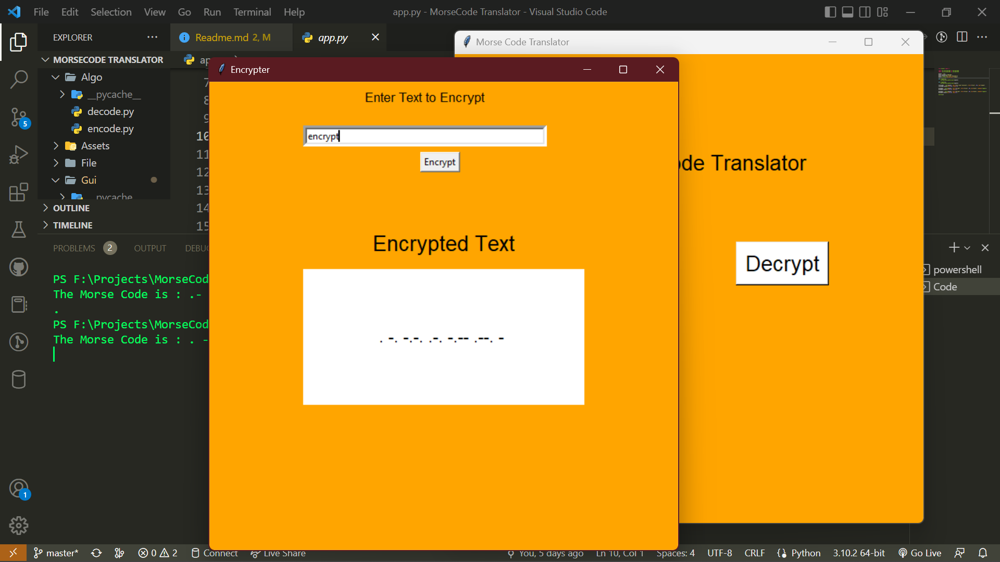

# Morse Code Translator in Python

INT 213 Project

Submitted by
[Shubhansu Kumar Singh (12104991)](https://github.com/shubhansu-kr),
[Kakani Sri Somanjali (12106451)](https://github.com/srisomanjali18) &
[Tanmay Mahajan (12106748)](https://github.com/tanmaym23)

B-Tech CSE (3rd semester)  
School of Computer Science and Engineering

## Introduction

Morse code is a method of transmitting string information into a series of dots[.] and dashes[-] encrypting a message between two entities and so making communication possible between two parties.

And we are going to have the fun task of doing just that.

## Abstract

Morse code is:

- an alphabet or code in which letters are represented by combinations of long and short light or sound signals.

- a method used in telecommunication to encode text characters as standardized sequences of two
different signal durations, called dots and dashes, or dots and dashes.

- named after Samuel Morse, one of the inventors of the telegraph.

The dot duration is the basic unit of time measurement in Morse code transmission. The duration of a dash is three times the duration of a dot. Each dot or dah within an encoded character is followed by a period of signal absence, called a space, equal to the dot duration. The letters of a word are separated by a space of duration equal to three dots, and words are separated by a space equal to seven dots.

This code takes input from the user in the form of string. It may be English or Morse code. The user is required
to set the following parameters according to his/her needs:

Select the mode:  
a. encrypt  
b. decrypt

After entering the data and choosing the options, the ‘encrypt and decrypt’ button has to be pressed after
which the translated code is displayed.

## Creating database

Database containing alphabets, numbers and corresponding Morse code is required. Dictionary is chosen for this purpose. The dictionary is a data structure consisting of key-value pairs. Two dictionaries are required for
this purpose:  

• Dictionary containing keys as alphabets and numbers and values as Morse code.  
• Dictionary containing keys as Morse code and values as alphabets and numbers.  
The symbols for the Morse code can vary according to the user, so the code was written as 0’s for short sign and 1’s for long sign, as it could be easily converted into other symbols.
It would be time consuming to enter the key-value pair one by one as:

MORSE_CODE_DICT= {}  
MORSE_CODE_DICT['a']= '.-'  
MORSE_CODE_DICT['b'] = '-…'  
MORSE_CODE_DICT['c'] = '-.-.'  
… and so on  

The resulting dictionary is:  
{'a': '.-', 'b': '-…', 'c': '-.-.', 'd': '-…', 'e': '.', 'f': '..-.', 'g':
'--.', 'h': '.... .', 'i': '..', 'j': '.---', 'k': '-.-', 'l': '.-..', 'm': '--',
'n': '-.', 'o': '---', 'p': '.--.', 'q': '--.-', 'r': '.-.', 's': '…', 't':
'-', 'u': '..-', 'v': '…-', 'w': '.--', 'x': '-..-', 'y': '-.--', 'z': '--..',
'1': '.----', '2': '..---', '3': '…--', '4': '….-', '5': '…..', '6':
'-.. ..', '7': '--…', '8': '---..', '9': '----.', '0': '-----'}

The resulting dictionary is:  
{".-": "a", "-...": "b", "-.-.": "c", "-..": "d", ".": "e",
"..-.": "f", "--.": "g", "....": "h", "..": "i", ".---": "j","-.-": "k", ".-
..": "l", "--": "m", "-.": "n", "---": "o", ".--.": "p", "--.-": "q", ".-.":
"r", "...": "s", "-": "t","..-": "u", "...-": "v", ".--": "w", "-..-": "x", "-
.--": "y", "--..": "z", " ": ""}

## Creating translator function

This function takes input in the form of string and some other parameters and returns translated string. It performs both the work:  

• translate English to Morse  
• translate Morse to English  

Morse is a very versatile language in which, the short and long signal can be transmitted through various methods, like through sound pulses, light pulses or by representing them with symbols.

According to the Morse Code standards, the space between:  
• parts of same letter: 0 unit  
• letters: 1 units  
• words: 2 units  

- [Decoding](./Algo/decode.py)  
- [Encoding](./Algo/encode.py)  
- [Home page](./app.py)  
- [Encryption](./Gui/encrypterGUI.py)  
- [Decryption](./Gui/decrypterGUI.py)  

## Creating GUI

• from tkinter import *from tells the compiler to import something. Tkinter is a library in
python and* means to import everything. The full line tells compiler to import everything from
the library python.  

• MASTER= Tk()To initialize tkinter, we have to create a Tk root widget, which is a window with a title bar and other decoration provided by the window manager.  

• master. mainloop()is simply a method in the main window that executes what we wish to
execute in an application (lets Tkinter to start running the application). As the name implies it will loop forever until the user exits the window or waits for any events from the user.

• master.geometry(“600x600) sets the default size of the GUI window to 600 by 600.

• master.minsize(600,600) sets the minimimum size that can be given to the GUI window to
600 by 600.

• mastertitle(“Morse code Translator”) sets the title of the GUI window in the title bar to
“Morse code Translator”.

• master.configure(bg="orange”) is used to access an object's attributes after its initialization.

## Widgets Used

• Label The Label widget is used to provide a single-line caption for other widgets. It can also contain images.

• RadiobuttonThe Radiobutton widget is used to display a number of options as radio buttons. The
user can select only one option at a time.

• ButtonThe Button widget is used to display buttons in your application.

• EntryThe Entry widget is used to display a single-line text field for accepting values from a user.

• TextThe Text widget is used to display text in multiple lines.

• messageboxThis module is used to display message boxes in your applications.

• MenuThe goal of this widget is to allow us to create all kinds of menus that can be used by our
applications.

## ScreenShots

---

---

